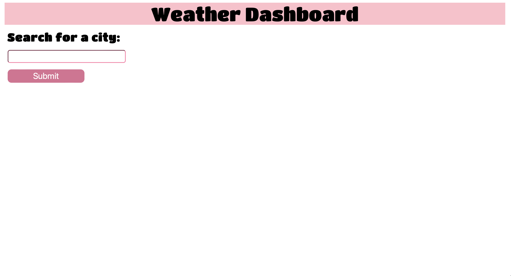

# WeatherDashboardCahllenge
Challenge:
Create a weather dashboard that allows a user to search for a city and is then shown information for the current weather including humidity, UV index and wind speed as well as a 5 day forecast for that same city. This challenge will implement the use of third party APIs's such as the Open Weather Map application API which will retrieve necessary data for that specific city.

Live URL: https://jsumbak.github.io/WeatherDashboardCahllenge/

Screenshot
